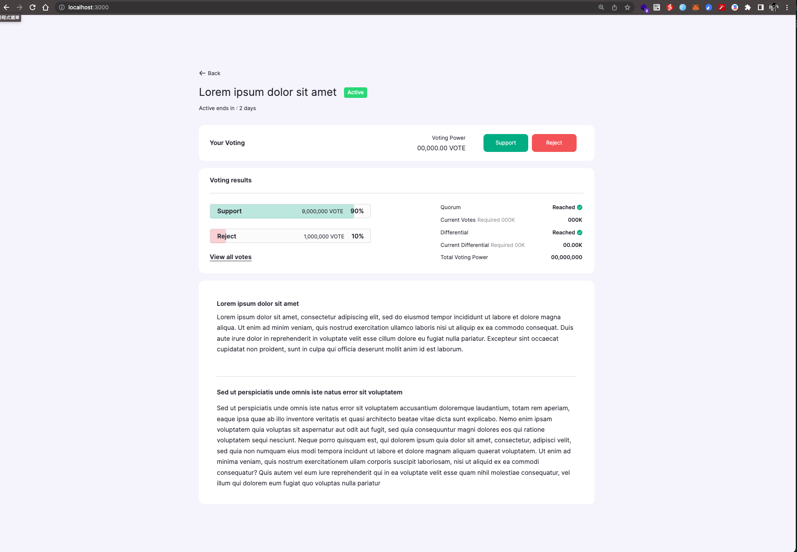

# Simple Application

## Introduction

This directory contains the source code for a simple static single page view implementation using Next.js and React. The interface is designed based on the provided [Figma design](file:///Users/morrislin/Downloads/Fullstack_Software_Engineer_Take_Home_Assignment_2.pdf).

[Online Demo](https://beta-fullstack-assignment.vercel.app/)

## Getting Started

First, run the development server:

```bash
npm install 
npm run dev
# or
yarn install
yarn dev
# or
pnpm install
pnpm dev
```

Open [http://localhost:3000](http://localhost:3000) with your browser to see the result.



You can start editing the page by modifying `app/page.tsx`. The page auto-updates as you edit the file.
