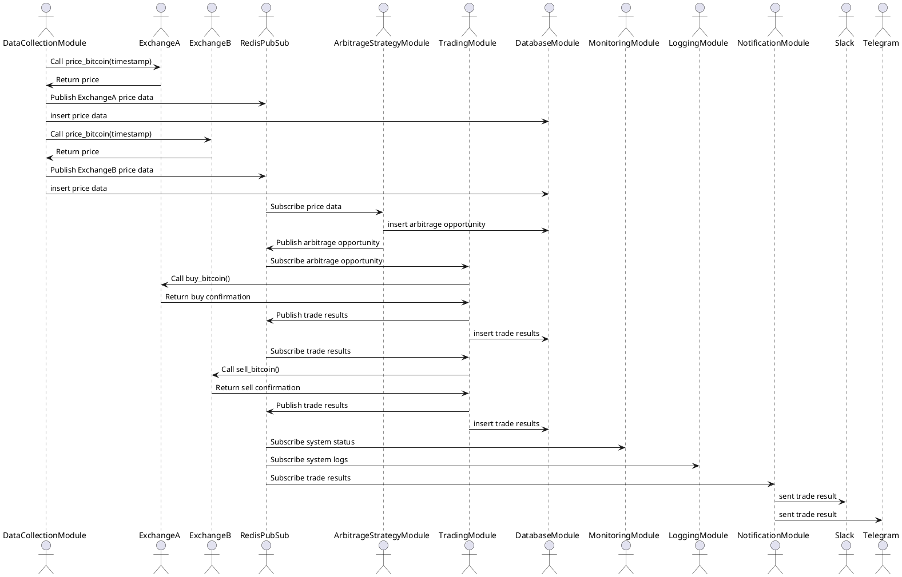

# solution

## System Design

#### System Sequence Diagram

[PlantUML onlone view](http://www.plantuml.com/plantuml/png/pPI_JiCm4CRtF8L767Y13gXDOQC8KNRaE5VNmh4ZtraYRyyfz8_hEgK3I2njuzxlldoVxPiZoK2nivLKv8Dua2INtbfGPBnR-JPQsFtr-AcsqcbOPC_rxlaLMeCliLd7PhUo28sX83Mi-PD03oVzte9iZTFfsYZVI8IJnPLtXh_psYUlTRxsxCbiZ99dBx-sKdtiXS623hAhgf9RSNT_j2fcOYcj5Nqm2jxPZVB6tP3f04bs_Mrrh6Iis6x6mL0Cxhl7f6II7YFymnhS9Yyoqg9bUgf55XvtCGuXK8h-wBY-sd7zjuxhttASoZ1IF9CZomMeWcaWnSlb5yNb7X6-xtsWw0mDbngLWoYtoUqaboWpKURJ-l9HR-9msFRiV2TmkirC2ENTneHkl7Yvo9H3uZ8G0J1QmWoQpZV3hWzaMgvy0n2iBIHHJoSn8lycYcnkPcdWW0ITG98KCIUJqLh6hDVdUjdmlPn_ePXRZ6EQAGHtwgvSVnZbHMGEhesT_G80)

#### System Component Diagram

```plantuml
@startuml

package "Cryptocurrency Arbitrage System" {
  [Data Collection Module] as data_collection
  [Arbitrage Strategy Module] as strategy_module
  [Trading Module] as trading_module
  [Database Module] as database_module
  [Monitoring Module] as monitoring_module
  [Logging Module] as logging_module
  [Notification Module] as notification_module
  
  [Exchange A] as exchange_a
  [Exchange B] as exchange_b
  [Redis Pub/Sub] as redis_pubsub
  [Slack] as slack
  [Telegram] as telegram

  data_collection --> exchange_a : Get Price
  data_collection --> exchange_b : Get Price
  data_collection --> redis_pubsub : Publish Price Data
  data_collection --> database_module : Insert Price Data
  
  strategy_module --> redis_pubsub : Subscribe Price Data
  strategy_module --> database_module : Insert Arbitrage Opportunity
  strategy_module --> redis_pubsub : Publish Arbitrage Opportunity

  trading_module --> redis_pubsub : Subscribe Arbitrage Opportunity
  trading_module --> exchange_a : Buy Bitcoin
  trading_module --> exchange_b : Sell Bitcoin
  trading_module --> redis_pubsub : Publish Trade Results
  trading_module --> database_module : Insert Trade Results

  monitoring_module --> redis_pubsub : Subscribe System Status
  logging_module --> redis_pubsub : Subscribe System Logs
  
  notification_module --> redis_pubsub : Subscribe Trade Results
  notification_module --> slack : Send Trade Result
  notification_module --> telegram : Send Trade Result
}

@enduml
```

[PlantUML onlone view](http://www.plantuml.com/plantuml/png/bPJ1Qjmm48RlUeeXzz1x3oNPj9H2quQujr8MIPuweh9af17KbBvxFTfbAmij8ZVxd_-RqMWyleia0wNPYaNgNt92k7a8wq9Ufn3GwHNkWp8KE3AiaN2-WJy2uFjxIH8UlBMeoNW7ZtvC5d-0Z31keQE-XDXT9A4W2QUr1E9PEyvPO-1RaADnK-cYarIO-0nAHgoBirRO7hqpv4ELRhweXVMpdwRAPxDKchvuCZ-DbdNVhj3_svduy5k_I3SXt6SZdb-FSXSyx8EAWyyucWXFIRqPaihnmCfnIIgcx1ZiDhWSYVoKBmyjJa7EMQNpYn1GJmPkRzyLXu6ty149deBHs3EhlhayATkt9go9BoS4U7PjhXxXXdvo4GFjIG7rTzCgEcmFEXY59TmYhvSjDk3hilX0oHbQ--NBdjif19GVTQ-3Tf9MZcgeXxJ2mP3sndNSkHvQsxPtUkILHNZ6c2p5aknVSSKAgBUpTpMdNnCC92bnRLxQLxBRwZCfeDxZVeQgywi9ye8oYMxSGTUPo_esiR_YRjFIRFy1)

## **Component Module**

- **Data Collection Module**: This module communicates directly with multiple exchanges (Exchange A, Exchange B, etc.) to gather real-time cryptocurrency price data. The module then publishes the gathered data to a Redis Pub/Sub channel. This design allows the module to operate independently of the rest of the system. The trade-off here is the need for reliable network connectivity with each of the exchanges, as any downtime could impact the accuracy of the data.
- **Arbitrage Strategy Module**: This module subscribes to the Redis Pub/Sub channel to receive the real-time price data. The decision to use a Redis Pub/Sub system allows for real-time data processing. This is essential for an arbitrage system, which needs to identify and act upon arbitrage opportunities as soon as they arise. The trade-off is that we're assuming there is low latency between the Redis server and the Arbitrage Strategy Module.
- **Trading Module**: This module listens for potential arbitrage opportunities and executes the trades. The design decision to separate this functionality into its own module allows for a clear separation of concerns: the Trading Module focuses on executing trades, while the Arbitrage Strategy Module focuses on identifying those opportunities. The trade-off here involves maintaining concurrent connections to multiple exchanges, which could be complex and error-prone.
- **Database Module**: The use of a database for persistence is a common design choice that allows for later analysis of price data, arbitrage opportunities, and trade results. The trade-off is the added complexity of managing a database, but the benefits of data persistence and analysis capabilities far outweigh this cost.
- **Monitoring and Logging Modules**: These modules are designed to ensure the system's smooth operation and allow for quicker debugging in case of any issues. The trade-off here is the extra development time required for these modules, but the benefits include reduced downtime and improved system reliability.
- **Notification Module**: This module sends notifications about trade results or system alerts to designated channels (e.g., Slack, Telegram). This decision was made to ensure that key stakeholders are always updated on the system's status and performance. The trade-off is the additional complexity of integrating with these external services, but the benefits in terms of improved communication and awareness are significant.

### "3C" of the Cryptocurrency Arbitrage System:

1. **Components**:
    - Data Collection Module: Collects cryptocurrency prices from various exchanges.
    - Arbitrage Strategy Module: Applies arbitrage algorithms on price data to identify opportunities.
    - Trading Module: Executes trades based on the identified arbitrage opportunities.
    - Database Module: Stores price data, arbitrage opportunities, and trade results.
    - Monitoring Module: Monitors the system's operation and alerts if something goes wrong.
    - Logging Module: Logs system events.
    - Notification Module: Sends notifications about trade results or system alerts.
2. **Connections**:
    - Data Collection to Redis PubSub: Publishes the collected data to a Redis channel.
    - Arbitrage Strategy to Redis PubSub: Subscribes to price data, identifies opportunities, and publishes them.
    - Trading to Redis PubSub: Listens for potential arbitrage opportunities and executes trades.
    - All modules to Database: Persist their outputs for record-keeping and later analysis.
    - Monitoring, Logging, and Notification modules: Receive data from Redis PubSub to carry out their functions.
3. **Constraints**:
    - Technical: The system needs to process data and execute trades in real-time, as delays could make arbitrage opportunities unprofitable. It also needs to handle large volumes of data from multiple cryptocurrency exchanges.
    - Business: The system needs to maximize profit and minimize risk. It also needs to be adaptable to changes in arbitrage strategy.
    - Regulatory: The system needs to comply with legal and regulatory requirements related to cryptocurrency trading.

### Why choose Event-driven architecture (EDA)**:**

- **Real-Time Processing**: Cryptocurrency markets move quickly. Prices can change in a matter of milliseconds. With an event-driven system, the system can react to these changes as soon as they occur, thereby increasing the chances of identifying and exploiting arbitrage opportunities.
- **Decoupling**: In EDA, components are loosely coupled. This means that each module in the system doesn't need to know about the others - it only needs to know about the events it should care about. This decoupling allows components to be developed, deployed, updated, and scaled independently, making the system more flexible and easier to maintain and scale.
- **Asynchronous Processing**: In an event-driven system, components can continue with other tasks without waiting for the processing of a previous event to complete. This is particularly important for an arbitrage system, where latency can result in missed opportunities.
- **Scalability**: EDA naturally supports horizontal scaling, as you can simply add more instances of each component to handle higher loads. This can be important in a trading system as the number of exchanges or the volume of trades increases.
- **Resiliency**: Due to its decoupled nature, EDA can provide a higher degree of resiliency. If one part of the system fails, the rest of the system can continue to function.

### Why not other design:

1. **Request/Response (Client-Server) Architecture**: In this architecture, the client sends a request to the server, and the server responds to the request. This is the most common architecture used in web development.

   **Pros**:

    - Simplicity: The request/response model is straightforward and easy to understand, making it simpler to develop and maintain.
    - Strong support: There are many development tools and libraries available for building systems based on this architecture.

   **Cons**:

    - Synchronous: The client waits for the server to respond before it can proceed, which could lead to inefficiencies or performance issues in a rapidly moving environment like a cryptocurrency market.
    - Scalability: While it's possible to scale a system built using this architecture by adding more servers, it might not be as scalable as an event-driven system.
2. **Microservices Architecture**: This architecture involves building a system as a collection of loosely coupled services. Each service is a small application that can run on its own.

   **Pros**:

    - Decoupling: Each service can be developed, deployed, and scaled independently.
    - Language-agnostic: Each microservice can be written in a different programming language, which might be beneficial in a complex system.

   **Cons**:

    - Complexity: Microservices architecture is inherently complex and requires careful design and management. This complexity can increase development time and costs.
    - Communication overhead: The services need to communicate with each other, which can lead to increased latency compared to a monolithic architecture.

### Why using **Redis Pub/Sub not Kafka for event-driven:**

In the context of our trading system, which involves real-time arbitrage strategies, the choice of message broker becomes critical. We require a solution that provides fast, near real-time data delivery, along with an intuitive API and design that simplifies the process of managing these data flows.

Redis Pub/Sub fits our needs perfectly due to the following reasons:

1. **Real-time data processing**: Redis Pub/Sub provides low latency and high throughput, enabling us to process and react to market data in real-time. This ensures that our arbitrage strategies can be executed promptly, a critical factor in their success.
2. **Simplicity and ease of use**: The design and API of Redis Pub/Sub are simpler compared to some other alternatives, such as Kafka. This means that we can more easily set up and manage our data flows, reducing overhead and freeing up resources to focus on our core trading logic.
3. **Memory-based storage**: Redis stores data in memory, which provides faster data access. Although this means Redis is not as durable or persistent as disk-based solutions like Kafka, this isn't a significant concern for us. We are primarily interested in the immediate consumption of real-time data for our arbitrage strategies, not long-term data retention.
4. **Data Persistence in Database**: While Redis Pub/Sub handles the real-time message brokering, we persist our trading data into a database for historical analysis and backtesting. This provides us the durability and data retention we need, without relying on our message broker to serve this purpose.

### What Else Do We Need to Concern?
In designing a robust, performant and scalable cryptocurrency arbitrage system, there are a number of concerns that should be taken into consideration.

* **Redis Queue Length**
  In an event-driven architecture, queue length is an important aspect to monitor. A continually growing queue length can be a sign of system imbalance where the producers are generating events faster than the consumers can handle. In the worst case, if the queue length exceeds the memory available to Redis, it can cause data loss or even bring down the entire system. Therefore, it's necessary to monitor and alert on queue length, and have mechanisms in place to handle such situations, like rate limiting the producers or dynamically scaling the consumers.

* **Delivery Semantics: At Least Once vs Exactly Once**
  Redis, by itself, doesn't offer strong guarantees about message delivery semantics. Depending on how it's used, you could end up with "at most once" or "at least once" delivery. "Exactly once" delivery requires additional mechanisms, like idempotent receivers and transactional processing, that must be built into the system. It's important to understand what level of delivery guarantee your system requires, and design it accordingly.

* **Exchange API Limits**
  Cryptocurrency exchanges often have API rate limits to prevent abuse. These limits can be on the number of requests per minute, the number of orders per minute, etc. If your system exceeds these limits, the exchange may throttle or even ban your system. Hence, the system should be designed to stay within these limits, for example by implementing rate limiting, using websockets for data streaming if available, or distributing API calls across multiple accounts or IP addresses.

* **Event-Driven Bottleneck**
  In an event-driven system, one slow component can slow down the entire system. This is especially a problem if you have a single-threaded event loop, as is common in languages like JavaScript. To mitigate this, you should ensure that all event handlers are as fast as possible, and offload any heavy processing to worker threads or separate processes.

* **Throughput and Latency**
  The system should be designed to maximize throughput (the number of events processed per unit time) and minimize latency (the time from when an event is generated to when it's processed). This can be achieved by using efficient algorithms and data structures, minimizing I/O, and using appropriate concurrency models.

* **High Availability (HA)**
  In a high-stakes environment like cryptocurrency trading, downtime can be costly. The system should be designed for high availability. This can involve replicating critical components, using health checks and automatic failover, and choosing reliable cloud providers and regions. All dependencies, including Redis and the exchanges, should also be monitored for availability.

Summary
Designing a cryptocurrency arbitrage system is a complex task that involves balancing a number of concerns. The event-driven architecture provides a good foundation, but it needs to be combined with careful design and architecture to handle issues like queue length, delivery semantics, API rate limits, throughput, latency, and high availability.